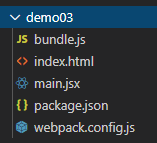

# webpack

# 前言

webpack作为当下前端最火的模块化打包工具，具有强大丰富的功能，它能够分析项目结构，处理模块化依赖，转换成为浏览器可运行的代码等。概括如下：

* 代码转换: TypeScript 编译成 JavaScript、SCSS,LESS 编译成 CSS.

* 文件优化：压缩 JavaScript、CSS、HTML 代码，压缩合并图片。

* 代码分割：提取多个页面的公共代码、提取首屏不需要执行部分的代码让其异步加载。

* 模块合并：在采用模块化的项目里会有很多个模块和文件，需要构建功能把模块分类合并成一个文件。

* 自动刷新：监听本地源代码的变化，自动重新构建、刷新浏览器。

* 构建把一系列前端代码自动化去处理复杂的流程，解放生产力。

### 引入webpack

全局引入webpack

  ```shell
  $ npm install -g webpack
  ```

webpack4.x后需要引入webpack-cli

  ```shell
  $ npm install -g webpack-cli
  ```

### webpack常用命令

* webpack – 开发环境打包

* webpack -p – 生产环境打包

* webpack --watch – 监听变动自动打包

* webpack -d – 生成map映射

* webpack --colors – 打包过程颜色输出

------------

## webpack 入门: webpack-demos 学习笔记

> 通过对[webpack-demos](https://github.com/ruanyf/webpack-demos)内15个demo案例的分析，来对webpack进行入门级的学习。

### demo1 Enrty file

先看文件目录


其中webpack.config.js为webpack配置文件

  ```javascript
  // webpack.config.js
  module.exports = {
    entry: './main.js',
    output: {
      filename: 'bundle.js'
    }
  };
  ```

可以说是最基础的一个例子，entry为webpack入口所在位置

  ```javascript
  // main.js
  document.write('<h1>Hello World</h1>');
  ```

而output对应的bundle.js就是webpack根据main.js模块化打包生成的一个js文件，并会被html引入，从效果上来说与用script标签引入main.js代码相同。

总结：output和entry为webpack的入口与出口文件，output的默认路径为./dist

### demo2 Multiple entry files


从名字也可以看出，demo2就是demo1的一个多文件版本，来看一下配置文件

  ```javascript
  // webpack.config.js
  module.exports = {
    entry: {
      bundle1: './main1.js',
      bundle2: './main2.js'
    },
    output: {
      filename: '[name].js'
    }
  };
  ```
入口文件有main1.js和main2.js两个，而出口文件从文件目录中可知有bundle1.js和bundle2.js两个文件，可见出口文件的[name]即为一个参数，默认情况下name为bundle。

总结： 出入口文件可以有多个，出口文件的命名可以根据参数决定。

### demo3 Babel-loader



相比于demo1，demo3的main.js被替换为了main.jsx文件，众所周知，jsx是React最基本的文件格式，而光有出入口的webpack无法解析javascript以外格式的文件。那么来看一下配置。

  ```javascript
  // webpack.config.js
  module.exports = {
    entry: './main.jsx',
    output: {
      filename: 'bundle.js'
    },
    module: {
      rules: [
        {
          test: /\.jsx?$/,
          exclude: /node_modules/,
          use: {
            loader: 'babel-loader',
            options: {
              presets: ['es2015', 'react']
            }
          }
        }
      ]
    }
  };
  ```

webapck通过babel-loader将jsx编译为js文件，输出至bundle.js。

总结： loader有两个关键点，一个是test，通过正则表达式匹配某一格式的文件。另一个是loader，表明用何种loader来对该文件格式进行处理，可使其成为一个js格式的文件。

### demo4 css-loader

从文件内容与名字上来看，就是通过webpack的css-loader对css文件进行解析。

  ```javascript
  module.exports = {
    entry: './main.js',
    output: {
      filename: 'bundle.js'
    },
    module: {
      rules:[
        {
          test: /\.css$/,
          use: [ 'style-loader', 'css-loader' ]
        },
      ]
    }
  };
  ```

来看配置文件，除了css-loader外，值得注意的还有一个style-loader，它在此处的作用就是为html注入style标签，以此来使css生效。

### demo5 Image loader

webpack对png或jpg格式图片进行处理，形式与前两个相同。

  ```javascript
  // webpack.config.js
  module.exports = {
    entry: './main.js',
    output: {
      filename: 'bundle.js'
    },
    module: {
      rules:[
        {
          test: /\.(png|jpg)$/,
          use: [
            {
              loader: 'url-loader',
              options: {
                limit: 8192
              }
            }
          ]
        }
      ]
    }
  };
  ```

从配置文件的内容来看，通过url-loader为html注入一个img的标签，来使图片正确显示。