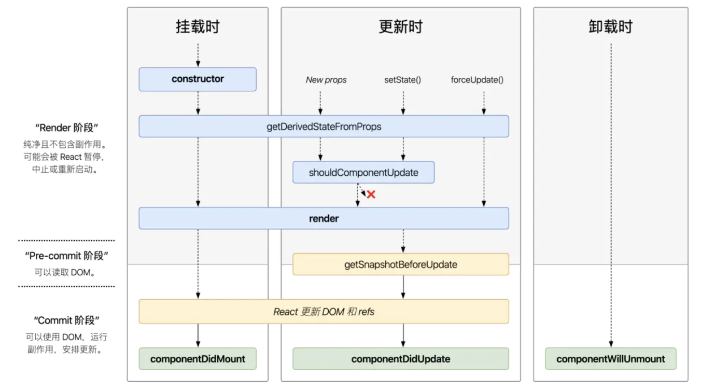

# React 生命周期

## React v16.4 前的生命周期


### initialization

也就是以下代码中类的构造方法( constructor() ),Test 类继承了 react Component 这个基类，也就继承这个 react 的基类，才能有 render(),生命周期等方法可以使用，这也说明为什么函数组件不能使用这些方法的原因。

super(props)用来调用基类的构造方法( constructor() ), 也将父组件的 props 注入给子组件，功子组件读取(组件中 props 只读不可变，state 可变)。
而 constructor()用来做一些组件的初始化工作，如定义 this.state 的初始内容。

```jsx
import React, { Component } from "react";

class Test extends Component {
  constructor(props) {
    super(props);
  }
}
```

### Mounting

此阶段分为 componentWillMount，render，componentDidMount 三个时期。

- componentWillMount  
  在组件挂载到 DOM 前调用，且只会被调用一次，在这边调用 this.setState 不会引起组件重新渲染，也可以把写在这边的内容提前到 constructor()中，所以项目中很少用。

- render:  
  根据组件的 props 和 state（无两者的重传递和重赋值，论值是否有变化，都可以引起组件重新 render） ，return 一个 React 元素（描述组件，即 UI），不负责组件实际渲染工作，之后由 React 自身根据此元素去渲染出页面 DOM。render 是纯函数（Pure function：函数的返回结果只依赖于它的参数；函数执行过程里面没有副作用），不能在里面执行 this.setState，会有改变组件状态的副作用。

- componentDidMount:  
  组件挂载到 DOM 后调用，且只会被调用一次，一般异步的操作可以放在此处

### update

在讲述此阶段前需要先明确下 react 组件更新机制。setState 引起的 state 更新或父组件重新 render 引起的 props 更新，更新后的 state 和 props 相对之前无论是否有变化，都将引起子组件的重新 render。

造成组件更新有两类（三种）情况：

1. 父组件重新 render

   父组件重新 render 引起子组件重新 render 的情况有两种:

   a. 直接使用,每当父组件重新 render 导致的重传 props，子组件将直接跟着重新渲染，无论 props 是否有变化。可通过 shouldComponentUpdate 方法优化。

   ```jsx
   class Child extends Component {
     shouldComponentUpdate(nextProps) {
       // 应该使用这个方法，否则无论 props 是否有变化都将会导致组件跟着重新渲染
       if (nextProps.someThings === this.props.someThings) {
         return false;
       }
     }
     render() {
       return <div>{this.props.someThings}</div>;
     }
   }
   ```

   b. 在 componentWillReceiveProps 方法中，将 props 转换成自己的 state

   ```jsx
   class Child extends Component {
     constructor(props) {
       super(props);
       this.state = {
         someThings: props.someThings,
       };
     }

     componentWillReceiveProps(nextProps) {
       // 父组件重传 props 时就会调用这个方法
       this.setState({ someThings: nextProps.someThings });
     }
     render() {
       return <div>{this.state.someThings}</div>;
     }
   }
   ```

   根据官网的描述

   在该函数(componentWillReceiveProps)中调用 this.setState() 将不会引起第二次渲染。

   是因为 componentWillReceiveProps 中判断 props 是否变化了，若变化了，this.setState 将引起 state 变化，从而引起 render，此时就没必要再做第二次因重传 props 引起的 render 了，不然重复做一样的渲染了。

2. 组件本身调用 setState，无论 state 有没有变化。可通过 shouldComponentUpdate 方法优化。

   ```jsx
   class Child extends Component {
     constructor(props) {
       super(props);
       this.state = {
         someThings: 1,
       };
     }
     shouldComponentUpdate(nextStates) {
       // 应该使用这个方法，否则无论 state 是否有变化都将会导致组件重新渲染
       if (nextStates.someThings === this.state.someThings) {
         return false;
       }
     }

     handleClick = () => {
       // 虽然调用了 setState ，但 state 并无变化
       const preSomeThings = this.state.someThings;
       this.setState({
         someThings: preSomeThings,
       });
     };

     render() {
       return <div onClick={this.handleClick}>{this.state.someThings}</div>;
     }
   }
   ```

此阶段分为 componentWillReceiveProps，shouldComponentUpdate，componentWillUpdate，render，componentDidUpdate

- componentWillReceiveProps(nextProps)

  此方法只调用于 props 引起的组件更新过程中，响应 Props 变化之后进行更新的唯一方式，参数 nextProps 是父组件传给当前组件的新 props。但父组件 render 方法的调用不能保证重传给当前组件的 props 是有变化的，所以在此方法中根据 nextProps 和 this.props 来查明重传的 props 是否改变，以及如果改变了要执行啥，比如根据新的 props 调用 this.setState 出发当前组件的重新 render

- shouldComponentUpdate(nextProps, nextState)

  此方法通过比较 nextProps，nextState 及当前组件的 this.props，this.state，返回 true 时当前组件将继续执行更新过程，返回 false 则当前组件更新停止，以此可用来减少组件的不必要渲染，优化组件性能。

  如果 shouldComponentUpdate 返回 false，那就一定不用 rerender(重新渲染 )这个组件了，组件的 React elements(React 元素) 也不用去比对。 但是如果 shouldComponentUpdate 返回 true，会进行组件的 React elements 比对，如果相同，则不用 rerender 这个组件，如果不同，会调用 render 函数进行 rerender。

- componentWillUpdate(nextProps, nextState)

  此方法在调用 render 方法前执行，在这边可执行一些组件更新发生前的工作，一般较少用。

- render

  render 方法在上文讲过，这边只是重新调用。

- componentDidUpdate(prevProps, prevState)
  此方法在组件更新后被调用，可以操作组件更新的 DOM，prevProps 和 prevState 这两个参数指的是组件更新前的 props 和 state

### Unmount

- componentWillUnmount

  此方法在组件被卸载前调用，可以在这里执行一些清理工作，比如清楚组件中使用的定时器，清楚 componentDidMount 中手动创建的 DOM 元素等，以避免引起内存泄漏。

## React v16.4 后的生命周期

在说 v16.4 之后的生命周期之前，我们先来谈一下 v16 这个版本有什么重大改变。

React v16 做的重大的改变就是引入了 React Fiber。React Fiber 是对核心算法的重新实现，带来的主要效果是页面的性能更好了。

### React 同步更新的局限

在原先的 React 生命周期中，更新的过程是同步的，这会带来性能上的问题。

React 组件再进行更新时，会调用各个生命周期，并且对 Virtual DOM 进行 Diff，最后更新 DOM。这个过程是同步的，也就是在 React 进行更新时，到最后更新 DOM，这整个过程是不可被打断的，整个阶段会一直占用 CPU 进行计算，直到更新结束。

这样的设计在 DOM 树很大的时候会出现问题，假设每个节点更新需要 1ms，当更新 300 个节点时，需要 300ms，在整个组件更新的过程中，浏览器的主线程都是在处理更新上，假设用户在这中间在输入框内输入文字，也不会出现，直到更新结束后，之前输入的文字才会一股脑儿出现在输入框内。这样的卡顿显然对于用户体验来说是很差的。

归根到底，这是 React 之前设计的缺陷。React 在 v16 之前设计的调用是栈调度。理解上也比较容易，比如我们的组件是这样的结构:

```jsx
<A>
  <B>
    <C></C>
  </B>
</A>
```

在更新时会进行栈式更新: A -> B -> C -> B -> A。栈结构的缺点是它不可以被随意 break，再 continue。

### React Fiber

React Fiber 不再使用栈调度器，而是采用链表的结构。链表对于 break 和 continue 是友好的。

解决同步时间过长导致的性能问题就是使用分片来解决：React 将更新任务划分为很多小片，在一段小片任务结束后，会将控制权返回 React 负责协调的程序，再选择一个优先级比较高的小片进行执行。这就意味着 React 的更新过程是可以被打断的。

我们可以把 React 的一次更新划分为两个大阶段，第一个阶段 Reconciliation 是进行 Diff，计算出现有的 DOM 中哪些是需要更新的，这个阶段是可以被打断的；第二个阶段 Commit 是对计算得出的结果进行 DOM 更新，这个阶段还是不能被打断的。

具体在生命周期上，第一阶段的生命周期有

- componentWillMount
- componentWillReceiveProps
- shouldComponentUpdate
- componentWillUpdate

第二阶段的生命周期有

- componentDidMount
- componentDidUpdate
- componentWillUnmount

也就是说，第一阶段的生命周期都可能被重复执行，componentWillReceiveProps 和 shouldComponentUpdate 往往不包含副作用，所以多执行几次问题不大，但是 componentWillMount 和 componentWillUpdate 往往可能存在副作用（ajax 请求，setState），所以执行多次可能会导致问题。

由此，React 重新设计了生命周期



索性将第一阶段的生命周期全部改为纯函数，其中`shouldComponentUpdate`在前文中已经介绍，是对 Props 和 State 进行计算返回 true 或 false，是一个纯函数，初次之外，新增了一个函数`getDerivedStateFromProps`。

### getDerivedStateFromProps

在组件创建时和更新时的 render 方法之前调用，它应该返回一个对象来更新状态，或者返回 null 来不更新任何内容。（根据 nextProps 和 prevState 计算出预期的状态改变，返回结果会被送给 setState）

`getDerivedStateFromProps`是一个静态函数，使用前需要加`static`声明。静态函数无法在内部访问`this`，也就从根本上解决了副作用的问题。

### getSnapshotBeforeUpdate

getSnapshotBeforeUpdate() 被调用于 render 之后，可以读取但无法使用 DOM 的时候。它使您的组件可以在可能更改之前从 DOM 捕获一些信息（例如滚动位置）。此生命周期返回的任何值都将作为参数传递给 componentDidUpdate（）。
