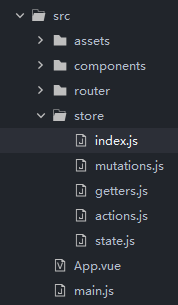

# VueX的使用

> **Vuex** 是一个专为 Vue.js 应用程序开发的状态管理模式。其思想借鉴于**Flux**， **Redux**。它采用集中式存储管理应用的所有组件的状态，并以相应的规则保证状态以一种可预测的方式发生变化。

* 介绍： [VueX是什么](https://vuex.vuejs.org/zh/)

## 为什么要使用Vuex

* 所谓的状态管理模式的状态，可以理解为一组通过 **Vuex** 进行维护的全局变量。一些用户的个人参数，亦或是多组件共同维护的prop。为了正确维护这些参数，可以使用数据库进行存储，也可以在各类组件之间多次传递。虽然方法可行，但在维护的过程中，可以明显感受非常麻烦。此时使用 **Vuex** 来进行存储与维护，很容易就能化繁为简。当然，**Vuex** 并不适合用于比较小型的应用。

## 引入Vuex

* 安装

  ```shell
  npm install --save vuex
  ```

* vue-cli项目引入vuex

  ```javascript
  import Vue from 'vue';
  import Vuex from 'vuex'; //引入Vuex
  import App from './App'
  import router from './router'

  //使用Vuex
  Vue.use(Vuex);

  //定义Vuex实例
  const store = new Vuex.Store({

  })

  new Vue({
    el: '#app',
    store, //全局挂载Vuex
    router,
    components: { App },
    template: '<App/>'
  })
  ```

## Vuex核心概念

* **state** 用于共享数据存储

* **getter** 用于对共享数据进行处理操作

* **mutation** 用于注册改变数据状态

* **action** 解决异步改变共享数据

* **module** 数据维护模块化

从项目的角度考虑，可以将这五大核心分别进行维护，由于 **module** 相对于其他特征有所区别，所以先不进行引入。




### **State**

> 数据存储的位置，对象类型直接维护数据

* 定义

  ```javascript
  const state = {
    msg: 'Hello Vuex!';
  }
  export default state;
  ```

* 使用
  
  由于store已在Vue实例上进行全局挂载，所以我们可以直接获取到state中所储存的数据，其中this指向Vue实例。可以配合computed计算属性使用，或者在加载组件时进行赋值。

  ```javascript
  this.msg = this.$store.state.msg; // "Hello Vuex!"
  ```

  如果有安装vue-devtool，可以在其中Vuex的Tab页直接看到state所储存的数据。


### **getter** 

> 对state中的数据做统一的处理操作

* 如果没有getter，我们要对state的数据进行一些操作，可以直接对数据进行

  ```javascript
  msgCut() {
    this.msg = this.$store.state.substring(0, 5); // "Hello"
  }
  ```

* 由于state中的参数本身具有全局变量的特征，所以常常不止一处会对其进行一些操作，如果这些操作方法类似或者相同，那代码就会显得有些冗余，这个时候就可以使用getter来维护这些方法

* 定义

  ```javascript
  const getters = {
    cutString: state => {
      state.msg.substring(0, 5);
    }
  }
  export default getters;
  ```

* 使用

  ```javascript
  this.msg = this.$store.getters.cutString;
  ```

### **mutation**


### **action**


### **module**